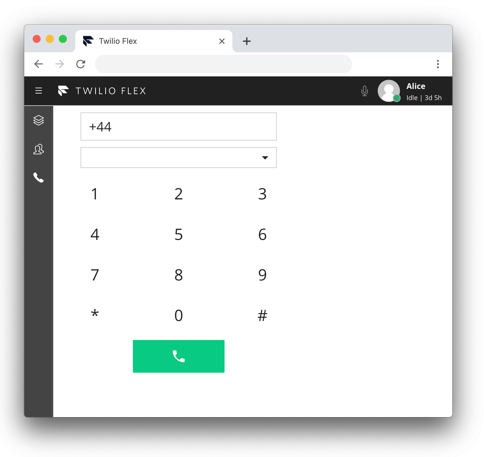
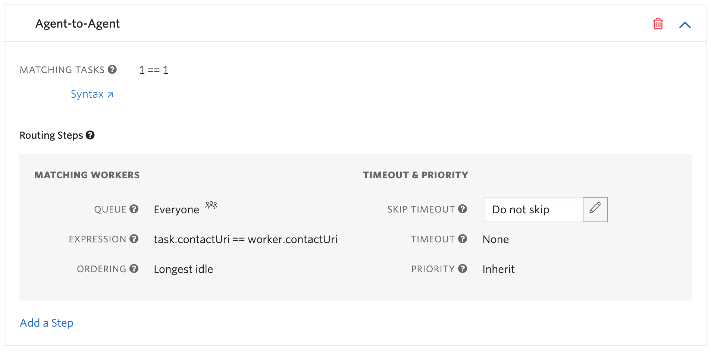

# Flex Plugin Phone 



This plug-in adds an icon to the side navigation bar which will open a phone. When a call is placed, a new TaskRouter Task is created through a Twilio Function and routed to the agent.

The phone supports calling a phone number and internal agent-to-agent calls within the same Flex instance.

This application is provided as-is. Twilio does not officially support it.

## Setup

Make sure you have [Node.js](https://nodejs.org) as well as [`npm`](https://npmjs.com) installed.
Afterwards install the dependencies by running `npm install`:


## Deploy Twilio Functions
Go to your [Twilio Functions](https://www.twilio.com/console/runtime/functions/manage) and deploy the functions in the `/functions` directory.

The function paths must match the function file names.

Note the below functions need to have the Access Control checkbox, Check for valid Twilio signature unchecked.

Flex Phone Initiate Call (/initiate-call)
Flex Dialpad Hold Call (/hold-call)

In the Function Configuration tab you will need to make your credentials available in your Function code by checking the `Enable ACCOUNT_SID and AUTH_TOKEN` option. Additionally, you will need to configure three environmental variables:

`TWILIO_WORKSPACE_SID` - Flex Task Assignment is the only available Workspace that was created with your Flex account.
`TWILIO_WORKFLOW_SID` - the TaskRouter Workflow used to enqueue the task
`TWILIO_CALLER_ID` - the callerId used to call a phone number

You will need to add the NPM package, `twilio-flex-token-validator`, as a Dependency under the [Twilio Functions Dependencies](https://www.twilio.com/console/runtime/functions/configure) section.

Task Router
In the TaskRouter -> Task Channels, please verify that channel `custom1` exists. If not, please create it.

Within your Workflow add a routing step with the expression `task.contact_uri == worker.contact_uri` to ensure the task for the outbound call is routed to the agent only who initiated the call.




## Development

In order to develop locally, you can use the Webpack Dev Server by running:

```bash
npm start
```

This will automatically start up the Webpack Dev Server and open the browser for you. Your app will run on `http://localhost:8080`. If you want to change that you can do this by setting the `PORT` environment variable:

```bash
PORT=3000 npm start
```

When you make changes to your code, the browser window will be automatically refreshed.

## Deploy

Once you are happy with your plugin, you have to bundle it, in order to deply it to Twilio Flex.

Run the following command to start the bundling:

```bash
npm run build
```

Afterwards, you'll find in your project a `build/` folder that contains a file with the name of your plugin project. For example `plugin-example.js`. Take this file and upload it into the Assets part of your Twilio Runtime.

Note: Common packages like `React`, `ReactDOM`, `Redux` and `ReactRedux` are not bundled with the build because they are treated as external dependencies so the plugin will depend on Flex which would provide them globally.